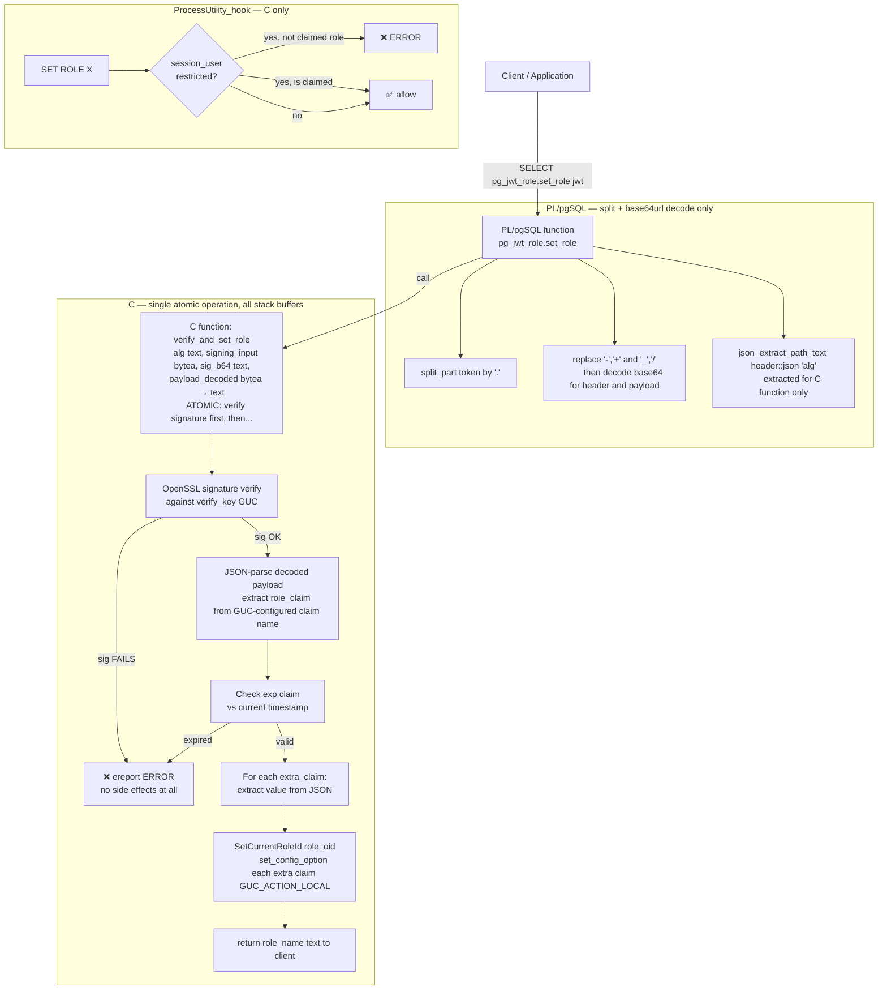
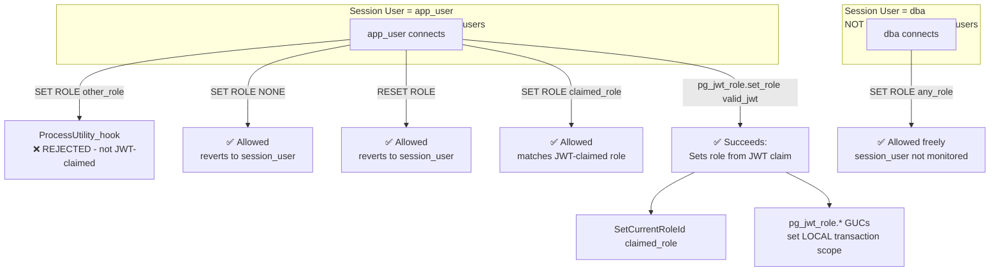
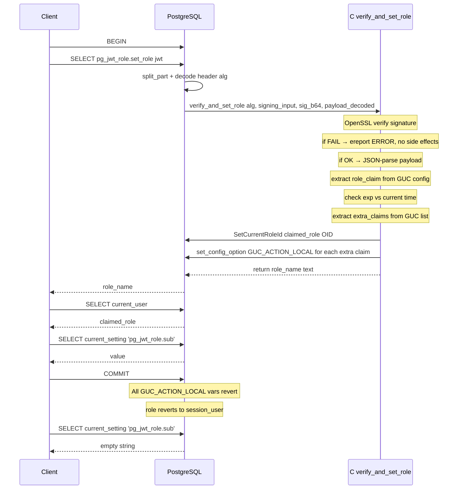
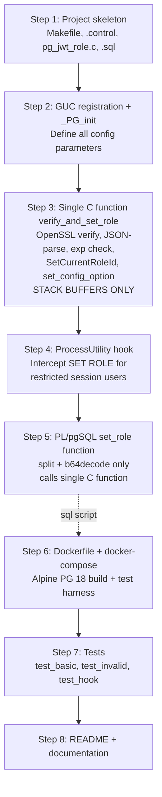

# pg_jwt_role — PostgreSQL Extension Plan

## 1. Overview

The `pg_jwt_role` extension provides JWT-based role management for PostgreSQL 18 on Alpine Linux. It implements:

1. A PL/pgSQL function `pg_jwt_role.set_role(jwt_token text)` acting as the orchestration layer — handles JWT parsing, base64url decode via translate/decode, JSON extraction via built-in functions, and extra claim management.
2. Two minimal C functions called by PL/pgSQL: `pg_jwt_role.verify_signature()` for JWT signature verification and `pg_jwt_role.set_current_role()` for the actual role switch — both allocation-free.
3. A `ProcessUtility_hook` that intercepts `SET ROLE <name>` commands for restricted session users — rejecting them unless the target matches the JWT-claimed role.
4. An architecture that **cannot** be bypassed: the claimed DB role can only be set through the JWT-validation function; any direct role-change command by restricted session users is blocked.

---

## 2. Language Decomposition

The extension uses a **layered architecture with a security-critical boundary**: PL/pgSQL only handles the mechanical parts of JWT preparation (split + base64url decode), while a **single atomic C function** handles everything that requires trust in the JWT — verification, claim extraction, role switching, and extra-claim GUC population.

| Layer | Responsibilities | Memory allocation |
|-------|-----------------|-------------------|
| **PL/pgSQL** `pg_jwt_role.set_role(text)` | Split JWT by `.`, base64url→base64 decode via `replace(replace(...))` + `decode()` | ✅ Natural palloc (PL/pgSQL-managed) |
| **C** `pg_jwt_role.verify_and_set_role(alg, signing_input, sig_b64, payload_decoded)` → text | **Atomic**: verify signature, then JSON-parse payload, extract `role_claim` + `extra_claims`, check `exp`, `SetCurrentRoleId()`, `set_config_option()` for extra claims. **Nothing happens unless sig is valid.** | ❌ None — fixed stack buffers for JSON scanning |
| **C** `ProcessUtility_hook` | Intercept SET ROLE for restricted session users | ❌ None — hook runs in place |

### Why the C function exists

| C function | Reason it cannot be PL/pgSQL |
|-----------|------------------------------|
| `verify_and_set_role(alg, signing_input, sig_b64, payload_decoded)` | Signature verification requires OpenSSL (`EVP_DigestVerify*`/`HMAC`). `SetCurrentRoleId()` is C-internal, not SQL-exposed. `set_config_option()` at C level is needed for atomicity. **These are merged into ONE atomic call so that `SetCurrentRoleId()` is only reachable after successful signature verification — no possible bypass.** |
| `ProcessUtility_hook` | Global function pointer — only setable from C (`_PG_init`) |

### Security principle: atomicity boundary

```
PL/pgSQL (trusted to split + decode)            C (single atomic operation)
┌────────────────────────────┐     ┌─────────────────────────────────┐
│ split_part → h,p,s        │     │ verify signature                │
│ base64url-decode header   │────>│   ├─ false → ereport(ERROR) ✗  │
│   → extract 'alg' via SQL │     │   └─ true  → continue...       │
│ base64url-decode payload  │     │ parse payload JSON             │
└────────────────────────────┘     │ extract role_claim             │
                                   │ check exp claim                │
                                   │ extract extra_claims            │
                                   │ SetCurrentRoleId                │
                                   │ set_config_option for each      │
                                   │ return role_name text           │
                                   └─────────────────────────────────┘
```

Everything below the dotted line **must** be atomic with verification. PL/pgSQL never touches claims before verification passes.

### What PL/pgSQL does (and why it's safe to do before verification)

| Operation | Expression | Why safe |
|-----------|-----------|----------|
| Split JWT by `.` | `split_part(token, '.', 1)` | Pure string slicing — no trust |
| Base64url→base64 | `replace(replace(part, '-', '+'), '_', '/')` | Character substitution — no trust |
| Base64 decode | `decode(fixed, 'base64')` | Mechanical byte conversion — no trust |
| Extract `alg` | `json_extract_path_text(...)` | Used only as input to C verification — if tampered, sig will fail |

### What the C function does (and why it must be atomic)

| Operation | Why it must happen after/before verification |
|-----------|---------------------------------------------|
| OpenSSL signature verify | **Must** verify before trusting any claim |
| JSON-parse payload | Only trust payload if sig is valid |
| Extract `role_claim` value | Only trust claim values if sig is valid |
| Check `exp` claim | Only trust expiration if sig is valid |
| Extract `extra_claims` | Only trust extra values if sig is valid |
| `SetCurrentRoleId()` | Only switch role if sig is valid |
| `set_config_option()` for extra claims | Only expose claims if sig is valid |

---

## 3. Architecture & Data Flow



### Security model



### Transaction boundary for claims



---

## 4. File Structure

```
pg-jwt-role/
├── Makefile                  # PGXS build + OpenSSL linkage
├── pg_jwt_role.control       # Extension control file
├── pg_jwt_role--1.0.sql      # SQL/PL/pgSQL definitions
├── pg_jwt_role.c             # C implementation (verify_sig + set_role + hook)
├── pg_jwt_role.h             # Internal header
├── Dockerfile                # Alpine Postgres 18 build + test
├── docker-compose.yml        # For running tests
├── test/
│   ├── expected/
│   │   ├── test_basic.out
│   │   ├── test_hook.out
│   │   └── test_invalid.out
│   ├── sql/
│   │   ├── test_basic.sql
│   │   ├── test_hook.sql
│   │   └── test_invalid.sql
│   └── test_jwt_helper.py    # Python helper to generate test JWTs
└── README.md
```

---

## 5. Configuration Parameters (GUCs)

All GUCs use prefix `pg_jwt_role.`. The function `set_role` uses `SET LOCAL` (transaction-bound) for extra claims, and `SetCurrentRoleId()` for the role.

| GUC name | Type | Context | Default | Description |
|----------|------|---------|---------|-------------|
| `pg_jwt_role.verify_key` | string | PGC_SIGHUP | (empty) | PEM-encoded public key or certificate for JWT signature verification (supports RS256, ES256; raw bytes for HS256) |
| `pg_jwt_role.role_claim` | string | PGC_SUSET | `role` | JWT claim name containing the target DB role |
| `pg_jwt_role.extra_claims` | string | PGC_SUSET | `sub,email` | Comma-separated list of extra JWT claims to expose as GUCs |
| `pg_jwt_role.restricted_session_users` | string | PGC_SIGHUP | `` | Comma-separated list of session users for whom SET ROLE is restricted to only the JWT-claimed role |
| `pg_jwt_role.max_jwt_len` | int | PGC_SUSET | 8192 | Maximum accepted JWT length in bytes |
| `pg_jwt_role.max_claim_len` | int | PGC_SUSET | 256 | Maximum length of any single claim value |

GUCs populated by `verify_and_set_role()` (transaction-local via `set_config_option GUC_ACTION_LOCAL`, privilege-elevated):

| GUC name | Type | Context | Description |
|----------|------|---------|-------------|
| `pg_jwt_role.role` | string | PGC_SUSET | The resolved role name from JWT |
| `pg_jwt_role.sub` | string | PGC_SUSET | The `sub` claim from JWT (if in extra_claims) |
| `pg_jwt_role.email` | string | PGC_SUSET | The `email` claim from JWT (if in extra_claims) |
| ... per extra_claims | string | PGC_SUSET | Dynamically populated |

**Protection against direct GUC tampering**: These output GUCs are registered with `PGC_SUSET` context — only superusers can write to them via SQL's `set_config()`. The C function `verify_and_set_role()` temporarily elevates to superuser privileges via `SetUserIdAndSecContext(SECURITY_SUPERUSER)` before calling `set_config_option()`, then restores. This prevents any non-superuser from fabricating claim values via `SELECT set_config('pg_jwt_role.sub', 'fake', true)`.

---

## 6. API Surface

### Two functions: PL/pgSQL orchestration + single atomic C function

```sql
-- Orchestration function (PL/pgSQL) — split + base64url decode only
-- Everything that requires trust in the JWT is delegated to the C function atomically.
CREATE FUNCTION pg_jwt_role.set_role(jwt_token text)
  RETURNS text
  LANGUAGE plpgsql
  VOLATILE
  SET search_path = pg_catalog
  AS $$
DECLARE
  header_raw    text;
  payload_raw   text;
  signature_b64 text;
  header_b64    text;
  payload_b64   text;
  alg           text;
BEGIN
  -- 1. Split JWT by '.'  (mechanical — no trust)
  header_raw    := split_part(jwt_token, '.', 1);
  payload_raw   := split_part(jwt_token, '.', 2);
  signature_b64 := split_part(jwt_token, '.', 3);

  -- 2. Base64url -> base64 for header  (mechanical — no trust)
  header_b64 := replace(replace(header_raw, '-', '+'), '_', '/');

  -- 3. Extract alg from header (used only as input to C; if tampered, sig will fail)
  alg := json_extract_path_text(
    convert_from(decode(header_b64, 'base64'), 'utf8')::json,
    'alg'
  );

  -- 4. Base64url -> base64 for payload  (mechanical — no trust)
  payload_b64 := replace(replace(payload_raw, '-', '+'), '_', '/');

  -- 5. Delegate EVERYTHING atomic to C:
  --    verify signature -> JSON-parse payload -> extract role_claim
  --    -> check exp -> extract extra_claims -> SetCurrentRoleId
  --    -> set_config_option for each extra claim GUC_ACTION_LOCAL
  --    If signature fails, NO side effects occur.
  RETURN pg_jwt_role.verify_and_set_role(
    alg,
    signing_input  => convert_to(header_raw || '.' || payload_raw, 'utf8'),
    -- signing_input is the ASCII base64url(header).base64url(payload)
    signature_b64  => signature_b64,
    payload_decoded => decode(payload_b64, 'base64')
  );
END;
$$;
```

```sql
-- SINGLE atomic C function: verify + parse + set role + set extra claims
-- This is the ONLY SQL-callable C function in the extension.
-- It is IMPOSSIBLE to call SetCurrentRoleId without successful signature verification.
CREATE FUNCTION pg_jwt_role.verify_and_set_role(
    alg text,
    signing_input bytea,
    signature_b64 text,
    payload_decoded bytea
) RETURNS text
  LANGUAGE C
  STRICT
  VOLATILE
  SET search_path = pg_catalog
  AS 'MODULE_PATHNAME', 'pg_jwt_verify_and_set_role';
```

---

## 7. ProcessUtility Hook Design

The hook intercepts `T_VariableSetStmt` targeting `"role"` — i.e., `SET ROLE <name>`.

**Key design decision**: The restriction is based on `session_user` (the user who logged in), NOT `current_user`. This means:
- If `app_user` is listed in `pg_jwt_role.restricted_session_users`, any session where `app_user` connected directly will have `SET ROLE` restricted.
- If `dba` connects directly (not in `restricted_session_users`), `SET ROLE` is unrestricted.
- After `set_role()` switches `current_user`, the hook still checks `session_user` — so the restriction persists across role switches within the session.

`SET ROLE NONE` and `RESET ROLE` are intentionally **not** blocked — they merely revert to `session_user`, which poses no privilege escalation risk. `SET SESSION AUTHORIZATION` is superuser-only and irrelevant.

```c
static ProcessUtility_hook_type next_ProcessUtility_hook = NULL;

/* Helper: check if session_user is in pg_jwt_role.restricted_session_users */
static bool is_session_user_restricted(void);

static void pg_jwt_role_ProcessUtility(PlannedStmt *pstmt,
    const char *queryString,
    bool readOnlyTree,
    ProcessUtilityContext context,
    ParamListInfo params,
    QueryEnvironment *queryEnv,
    DestReceiver *dest,
    QueryCompletion *qc)
{
    Node *parsetree = pstmt->utilityStmt;

    /* Only check SET ROLE for restricted session users */
    if (nodeTag(parsetree) == T_VariableSetStmt && is_session_user_restricted())
    {
        VariableSetStmt *stmt = (VariableSetStmt *) parsetree;

        /*
         * Only block SET ROLE <name> where:
         *   - name != "none"
         *   - target role does NOT match the JWT-claimed role
         * SET ROLE NONE and RESET ROLE are allowed (safe revert to session_user).
         */
        if (strcmp(stmt->name, "role") == 0 &&
            stmt->kind == VAR_SET_VALUE && stmt->args != NULL)
        {
            char *target = strVal(linitial(stmt->args));

            if (strcmp(target, "none") != 0)
            {
                Oid target_oid = get_role_oid(target, true);
                Oid claimed_oid = GetCurrentRoleId();

                if (!OidIsValid(claimed_oid) || target_oid != claimed_oid)
                {
                    ereport(ERROR,
                        (errcode(ERRCODE_INSUFFICIENT_PRIVILEGE),
                         errmsg("pg_jwt_role: SET ROLE to \"%s\" rejected: "
                                "role must be set via pg_jwt_role.set_role()",
                                target)));
                }
            }
        }
    }

    /* Chain to next hook or standard */
    if (next_ProcessUtility_hook)
        next_ProcessUtility_hook(pstmt, queryString, readOnlyTree,
                                 context, params, queryEnv, dest, qc);
    else
        standard_ProcessUtility(pstmt, queryString, readOnlyTree,
                                context, params, queryEnv, dest, qc);
}
```

### How the security guarantee works

1. The extension is loaded via `shared_preload_libraries`, so the hook is installed before any user sessions start.
2. The restricted session users list is configured via `pg_jwt_role.restricted_session_users` GUC — this controls which **session users** have `SET ROLE` restricted.
3. When `session_user` is in `restricted_session_users`, `SET ROLE <name>` is intercepted and **only allowed** if:
   - `name` is `"none"` (safe revert to `session_user`), OR
   - the target role OID matches `GetCurrentRoleId()` (the role set by the atomic C function).
   - `RESET ROLE` is always allowed (same safe revert).
4. If `session_user` is **not** in `restricted_session_users`, no restrictions apply — `SET ROLE` works normally.
5. The **single** C function `verify_and_set_role()` atomically: verifies the JWT signature → extracts the role claim → calls `SetCurrentRoleId()`. There is **no separate SQL-callable function** that exposes `SetCurrentRoleId()` without prior signature verification.
6. Output GUCs (`pg_jwt_role.sub`, etc.) are registered with `PGC_SUSET` context — non-superusers cannot fabricate claim values via `SELECT set_config('pg_jwt_role.sub', 'fake', true)`. Only the C function can write them, via temporary superuser privilege elevation.
7. Restricted session users **cannot** grant themselves the SET option on any role via SQL — those DDL commands can also optionally be blocked.

---

## 8. C Implementation Details (Stack-Based, No malloc)

The single C function `pg_jwt_verify_and_set_role` uses only fixed-size stack buffers:

```c
/* Stack buffer size constants */
#define PG_JWT_MAX_ALG_LEN          16
#define PG_JWT_MAX_SIG_BYTES        512
#define PG_JWT_MAX_KEY_LEN          4096
#define PG_JWT_MAX_PAYLOAD_LEN      1024
#define PG_JWT_MAX_CLAIM_VAL_LEN    256
#define PG_JWT_MAX_CLAIMS           16
```

### Internal helper functions

```c
/* base64url -> binary decode (in-place on stack buffer) */
static int pg_base64url_decode(const char *src, int srclen, char *dst, int dstlen);

/* Minimal JSON string value extractor (no full parser — just key lookup) */
static bool pg_json_extract_value(const char *json, const char *key,
                                   char *out, int outlen);

/* Split CSV string from GUC into individual names */
static int pg_split_csv(const char *csv, char names[][PG_JWT_MAX_CLAIM_VAL_LEN], int max);

/* OpenSSL verification dispatcher (HMAC or EVP_DigestVerify based on alg) */
static bool pg_jwt_verify(const char *alg,
                           const char *signing_input, int signing_input_len,
                           const char *signature, int signature_len,
                           const char *key, int key_len);
```

### Signature verification algorithm dispatch

The algorithm is auto-detected from the JWT header `alg` field, passed from PL/pgSQL:

| Algorithm | OpenSSL API | Key format from `verify_key` GUC |
|-----------|-------------|----------------------------------|
| `HS256` / `HS384` / `HS512` | `HMAC(EVP_sha256(), ...)` | Raw key bytes |
| `RS256` / `RS384` / `RS512` | `EVP_DigestVerify*` with `EVP_PKEY` from PEM | PEM-encoded RSA public key or certificate |
| `ES256` / `ES384` / `ES512` | `EVP_DigestVerify*` with `EVP_PKEY` from PEM | PEM-encoded EC public key or certificate |

Signature comparison uses `CRYPTO_memcmp()` to prevent timing attacks.

### JSON key-value extractor (no full parser)

The payload is scanned linearly for key-value pairs — no token tree, no recursion:

```c
static bool pg_json_extract_value(const char *json, const char *key,
                                   char *out, int outlen)
{
    /* Scan for "key":  pattern using strstr */
    char pattern[PG_JWT_MAX_CLAIM_VAL_LEN + 8];
    snprintf(pattern, sizeof(pattern), "\"%s\":", key);

    const char *p = strstr(json, pattern);
    if (!p) return false;

    p += strlen(pattern);

    /* Skip whitespace */
    while (*p == ' ' || *p == '\t' || *p == '\n') p++;

    /* Extract string value between quotes */
    if (*p == '"')
    {
        p++;
        int i = 0;
        while (*p && *p != '"' && i < outlen - 1)
        {
            if (*p == '\\') { p++; if (!*p) break; }
            out[i++] = *p++;
        }
        out[i] = '\0';
        return true;
    }

    /* Extract numeric/bool/null value (for exp, etc.) */
    const char *start = p;
    while (*p && *p != ',' && *p != '}' && *p != ' ' && *p != '\t') p++;
    int len = Min(p - start, outlen - 1);
    memcpy(out, start, len);
    out[len] = '\0';
    return len > 0;
}
```

---

## 9. Privilege Elevation Pattern

Output GUCs (`pg_jwt_role.sub`, `pg_jwt_role.email`, etc.) are registered with `PGC_SUSET` context.
This means `SELECT set_config('pg_jwt_role.sub', 'fake', true)` fails for non-superusers.
Inside `verify_and_set_role()`, we temporarily elevate to superuser before calling `set_config_option()`:

```c
/* Inside verify_and_set_role(), after signature verification passes: */

/* Save current security context */
Syssec save_secctx;
GetUserIdAndSecContext(&save_userid, &save_secctx);

/* Temporarily become superuser for GUC writing */
SetUserIdAndSecContext(BOOTSTRAP_SUPERUSERID, SECURITY_SUPERUSER);

/* Write each extra claim GUC */
for (int i = 0; i < n_extra; i++)
{
    if (claim_vals[i][0] != '\0')
    {
        char guc_name[PG_JWT_MAX_CLAIM_VAL_LEN + 16];
        snprintf(guc_name, sizeof(guc_name), "pg_jwt_role.%s", claim_names[i]);
        set_config_option(guc_name, claim_vals[i],
                          PGC_SUSET, PGC_S_SESSION,
                          GUC_ACTION_LOCAL, true, 0, false);
    }
}

/* Restore original security context */
SetUserIdAndSecContext(save_userid, save_secctx);
```

**Note**: `SetCurrentRoleId()` switch is performed **before** the privilege elevation for GUC writing, so the role switch acts under the caller's authority (which is what we want — the JWT already authorizes it).

## 10. Extension Initialization

```c
/* Shared_preload_libraries entry point */
void _PG_init(void);

void _PG_init(void)
{
    /* Define custom GUCs */
    DefineCustomStringVariable("pg_jwt_role.verify_key", ...);
    DefineCustomStringVariable("pg_jwt_role.role_claim", ...);
    DefineCustomStringVariable("pg_jwt_role.extra_claims", ...);
    DefineCustomStringVariable("pg_jwt_role.restricted_session_users", ...);
    DefineCustomIntVariable("pg_jwt_role.max_jwt_len", ...);
    DefineCustomIntVariable("pg_jwt_role.max_claim_len", ...);

    /* Output GUCs — registered with PGC_SUSET to prevent direct SQL tampering */
    DefineCustomStringVariable("pg_jwt_role.role", ...,
        PGC_SUSET, ...);
    DefineCustomStringVariable("pg_jwt_role.sub", ...,
        PGC_SUSET, ...);
    DefineCustomStringVariable("pg_jwt_role.email", ...,
        PGC_SUSET, ...);
    /* Up to PG_JWT_MAX_CLAIMS total claim GUCs, all PGC_SUSET */

    /* Install ProcessUtility hook */
    next_ProcessUtility_hook = ProcessUtility_hook;
    ProcessUtility_hook = pg_jwt_role_ProcessUtility;
}
```

---

## 10. Build & Docker Setup

**Dockerfile** based on `postgres:18-alpine`:

```dockerfile
FROM postgres:18-alpine AS builder

RUN apk add --no-cache build-base openssl-dev

COPY . /usr/src/pg_jwt_role
WORKDIR /usr/src/pg_jwt_role

RUN make && make install

FROM postgres:18-alpine
COPY --from=builder /usr/local/lib/postgresql/pg_jwt_role.so /usr/local/lib/postgresql/
COPY --from=builder /usr/local/share/postgresql/extension/pg_jwt_role* /usr/local/share/postgresql/extension/

# Install test dependencies
RUN apk add --no-cache python3 py3-pip openssl
RUN pip3 install pyjwt

COPY test/ /test/
```

**Makefile** (PGXS):

```makefile
EXTENSION = pg_jwt_role
MODULES = pg_jwt_role
DATA = pg_jwt_role--1.0.sql
PGFILEDESC = "pg_jwt_role - JWT-based role management"

PG_CONFIG = pg_config
PGXS := $(shell $(PG_CONFIG) --pgxs)
include $(PGXS)

# Link OpenSSL
SHLIB_LINK += -lssl -lcrypto
```

---

## 11. Test Plan

Tests run via `docker-compose up --build test`:

| Test | What it validates |
|------|-------------------|
| `test_basic.sql` | Valid JWT with HS256 → role is set, `current_user` matches claim, extra claims available via `current_setting`, transaction rollback resets everything |
| `test_invalid.sql` | Expired JWT → ERROR, bad signature → ERROR, missing role claim → ERROR, oversize JWT → ERROR, unknown role → ERROR |
| `test_hook.sql` | Restricted session user tries `SET ROLE other` → ERROR, tries `SET ROLE claimed_role` → allowed, unmonitored session user unaffected |

### Test JWT generation

A Python helper `test/test_jwt_helper.py` generates test JWTs:

```python
#!/usr/bin/env python3
import jwt, time, sys

secret = sys.argv[1]
role = sys.argv[2]
extra = {}
for arg in sys.argv[3:]:
    k, v = arg.split("=", 1)
    extra[k] = v

payload = {"role": role, "exp": int(time.time()) + 3600, **extra}
token = jwt.encode(payload, secret, algorithm="HS256")
print(token)
```

---

## 12. Implementation Steps (Ordered Execution)



### Detailed step breakdown

**Step 1: Project skeleton**
- [`Makefile`](Makefile) — PGXS build rules with OpenSSL linking
- [`pg_jwt_role.control`](pg_jwt_role.control) — extension metadata
- [`pg_jwt_role.c`](pg_jwt_role.c) — minimal stub with `PG_MODULE_MAGIC` and empty `_PG_init`
- [`pg_jwt_role--1.0.sql`](pg_jwt_role--1.0.sql) — placeholder

**Step 2: GUC registration in `_PG_init`**
- Register all configuration GUCs (table in Section 5)
- Register output/claim GUCs: `pg_jwt_role.role`, `pg_jwt_role.sub`, `pg_jwt_role.email`, etc. (up to 16)
- Populate `_PG_init` with `DefineCustomStringVariable` calls

**Step 3: `pg_jwt_verify_and_set_role` C function (single atomic call)**
- Signature: `Datum pg_jwt_verify_and_set_role(PG_FUNCTION_ARGS)`
  - Input: `alg text`, `signing_input bytea`, `signature_b64 text`, `payload_decoded bytea`
  - Output: `text` (the claimed role name)
- Stack buffers only: `alg_buf[16]`, `sig_buf[512]`, `key_buf[4096]`, `payload_buf[1024]`, `role_name_buf[256]`, `claim_names[16][256]`, `claim_vals[16][256]`
- Read `verify_key`, `role_claim`, `extra_claims` GUCs via `GetConfigOptionByName`
- Inline base64url decode for signature
- Algorithm dispatch:
  - `HS256/HS384/HS512`: `HMAC(EVP_sha256(), ...)` with `CRYPTO_memcmp`
  - `RS256/RS384/RS512`: `EVP_DigestVerify*` with PEM public key
  - `ES256/ES384/ES512`: `EVP_DigestVerify*` with PEM EC key
- If signature fails → `ereport(ERROR)` — **no side effects at all**
- If signature OK → JSON key-value scan on decoded payload:
  - Extract `role_claim` value → `get_role_oid()` + `SetCurrentRoleId()`
  - Check `exp` claim vs `time(NULL)`
  - Extract `extra_claims` values → `set_config_option(name, val, GUC_ACTION_LOCAL)` for each
- No palloc, no malloc — all fixed stack buffers

**Step 4: ProcessUtility hook in `_PG_init`**
- Install in `_PG_init`:
  ```c
  next_ProcessUtility_hook = ProcessUtility_hook;
  ProcessUtility_hook = pg_jwt_role_ProcessUtility;
  ```
- Implementation as described in Section 7
- Helper `is_session_user_restricted()` checks `restricted_session_users` GUC against `GetUserNameFromId(GetSessionUserId(), false)`

**Step 5: PL/pgSQL `set_role` orchestration function**
- Full implementation as shown in Section 6
- Written in [`pg_jwt_role--1.0.sql`](pg_jwt_role--1.0.sql)
- **Only** handles: split JWT by `.`, base64url→base64 conversion for header and payload, decode header bytes, extract `alg` via `json_extract_path_text`
- Calls the **single** C function: `verify_and_set_role(alg, signing_input, signature_b64, payload_decoded)`
- **All** trust-requiring operations happen inside the C function after signature verification

**Step 7: Dockerfile + docker-compose**
- Multi-stage Dockerfile: builder with `build-base openssl-dev`, runtime `postgres:18-alpine`
- `docker-compose.yml` with services: `pg` (extension), `test` (runs pg_regress)

**Step 8: Tests**
- Write `test/sql/test_basic.sql` — valid JWT, check role+claims, COMMIT/ROLLBACK
- Write `test/sql/test_invalid.sql` — expired, bad sig, missing claim, unknown role
- Write `test/sql/test_hook.sql` — restricted user SET ROLE blocked/allowed, unmonitored user unaffected
- Generate expected outputs via `docker-compose run test`

**Step 9: README**
- Installation, configuration guide, usage examples, security model explanation

---

## 13. Security Considerations

The security model rests on **two independent layers** that reinforce each other:

### Layer 1: Atomic C function (no bypass of SetCurrentRoleId)

The single C function `verify_and_set_role()` is the **only code path** that calls `SetCurrentRoleId()`. It does so **only after** OpenSSL signature verification succeeds. There is no separate `set_current_role()` SQL function that could be called directly — the atomicity is enforced by the architecture itself.

```
PL/pgSQL set_role() → calls C verify_and_set_role()
                         ├─ OpenSSL verify → FAIL → ereport(ERROR), no side effects
                         └─ OpenSSL verify → OK → JSON parse → exp check
                                                  → SetCurrentRoleId
                                                  → set_config_option for extra claims
```

### Layer 2: ProcessUtility hook (blocks direct SET ROLE)

The hook checks `session_user` against `pg_jwt_role.restricted_session_users`. For restricted session users:

| Command / Action | Behavior | Rationale |
|-----------------|----------|-----------|
| `SET ROLE <x>` where x != claimed role | ❌ **BLOCKED** | Would escalate to unauthorized role |
| `SET ROLE <claimed_role>` | ✅ **Allowed** | Matches JWT-claimed role |
| `SET ROLE NONE` | ✅ **Allowed** | Safely reverts to session_user |
| `RESET ROLE` | ✅ **Allowed** | Safely reverts to session_user |
| `SET SESSION AUTHORIZATION` | N/A | Superuser-only command, not relevant |

For session users NOT in `restricted_session_users`, no restrictions apply.

The only way for a restricted session user to assume a **new** effective role is via `pg_jwt_role.set_role()` with a valid, non-expired, properly signed JWT.

### Other considerations

1. **Access control**: The `set_role()` function runs as the caller. Access is controlled by granting `EXECUTE` on the function to specific roles. Only users with `EXECUTE` privilege can call `set_role()` — and only the roles listed in `restricted_session_users` have their `SET ROLE` hooked.
2. **Key protection**: The `pg_jwt_role.verify_key` GUC is `PGC_SIGHUP` context — only superusers can set it via postgresql.conf or ALTER SYSTEM. It can hold a PEM-encoded public key, certificate, or raw key material depending on the algorithm.
3. **No dynamic allocation in C**: The single C function uses only fixed-size stack buffers — no `palloc`, no `malloc`. All heap allocation is in PL/pgSQL's natural palloc-managed execution. Stack buffer sizes: alg 16, sig 512, key 4096, payload 1024, claim values 256 each × 16.
4. **Transaction isolation**: Extra claims from JWT are set via C-level `set_config_option(..., GUC_ACTION_LOCAL)`, so they automatically revert on transaction end or rollback — equivalent to `SET LOCAL`.
5. **Length restrictions**: All input lengths are bounded by GUCs `max_jwt_len` (default 8192) and `max_claim_len` (default 256).
6. **Constant-time comparison**: Signature verification uses `CRYPTO_memcmp()` to prevent timing attacks on HMAC verification.
7. **No SQL injection**: All claim names and values are extracted by the C JSON scanner (not interpolated into SQL), so there is no SQL injection vector through JWT claims.
